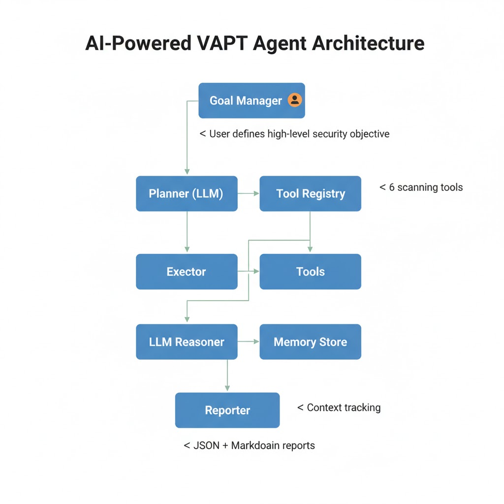

# AI-Powered VAPT Agent
An autonomous Vulnerability Assessment and Penetration Testing (VAPT) agent powered by **Ollama Llama 3.1** that can intelligently plan, execute, and report security assessments.


---
## 🎯 Overview
This project implements an **AI-powered VAPT Agent** that autonomously performs vulnerability assessments and penetration testing tasks by:
- **Reasoning**: Using LLM to decompose high-level security goals into actionable tasks
- **Planning**: Generating dynamic scan strategies based on objectives
- **Executing**: Running specialized security scanning tools
- **Adapting**: Adjusting approach based on real-time findings
- **Reporting**: Generating comprehensive security reports with AI summaries

Built for the **Clarice Systems Agentic AI Internship Assignment**.

---
## ✨ Features
### Core Capabilities (Phase 1)
✅ **Goal-Based Execution** - Accept high-level security objectives and autonomously plan actions
✅ **AI Reasoning Loop** - LLM evaluates progress and adapts strategy after each scan
✅ **Tool-Based Architecture** - 6 modular scanning tools for different vulnerability types
✅ **Memory Context** - Tracks findings and reasoning across the scan lifecycle
✅ **Adaptive Planning** - LLM-driven task decomposition and prioritization
✅ **Severity Scoring** - Automatic classification (Critical/High/Medium/Low/Info)
✅ **AI-Generated Summaries** - Executive summaries with natural language explanations
✅ **Dual Report Formats** - JSON and Markdown reports with reasoning traces

---
## 🏗️ Architecture



## 📋 Prerequisites
### Required Software
1. **Python 3.8+**
2. **Ollama** with Llama 3.1 (Start the service with `ollama serve`)
3. **Network Access** - Permission to scan target systems

### System Requirements
- **RAM**: 8GB+ (for Llama 3.1 8B model)

---
## 🚀 Installation
### Step 1: Clone/Download Project
```bash
mkdir vapt-agent
cd vapt-agent
Step 2: Set Up Python EnvironmentBashpython3 -m venv venv
# On Linux/Mac:
source venv/bin/activate
# On Windows:
venv\Scripts\activate
Step 3: Install DependenciesBashpip install langchain-ollama requests colorama python-dotenv
# Or use requirements.txt:
# pip install -r requirements.txt
Step 4: Start Ollama (in a separate terminal)Bashollama serve
# Pull Llama 3.1 model if needed:
ollama pull llama3.1:latest
🎮 Quick StartInteractive ModeBashpython main.py
You'll be prompted to enter the Goal and the Target.Command-Line ModeBashpython main.py "Scan for web vulnerabilities" "[https://example.com](https://example.com)"
Example OutputPlaintext============================================================
Goal: Scan for web vulnerabilities
Target: [https://example.com](https://example.com)
[Planning Phase] Decomposing goal into tasks...
✓ Generated plan with 5 tasks
...
[Execution Phase] Running scanning tools...
...
[Reporting Phase] Generating final report...
============================================================
SCAN COMPLETE
Executive Summary:
Security assessment identified 7 findings, including 2 high severity
issues that require immediate attention...
Reports generated:
📄 JSON: outputs/vapt_report_20251110_125830.json
📝 Markdown: outputs/vapt_report_20251110_125830.md
🛠️ Available ToolsTool NameDescriptionKey Functionalityvalidate_targetChecks URL/IP validity and reachability.Tests HTTP/HTTPS connectivity.scan_portsScans common ports for open services.Identifies risky services (FTP, Telnet).analyze_headersChecks HTTP security headers.Identifies missing HSTS, CSP, X-Frame-Options.scan_vuln_patternsScans for common vulnerability indicators.Tests for SQL injection and XSS patterns.check_ssl_tlsVerifies SSL/TLS configuration.Identifies SSL/TLS errors and standards.enumerate_directoriesDiscovers common directories and files.Tests for /admin, /.git, etc.📝 Example Test CasesTest CaseGoalTargetBasic Scan"Scan for web vulnerabilities"https://example.comHeaders Check"Check security headers"https://github.comComprehensive"Perform security assessment"http://testphp.vulnweb.com⚙️ ConfigurationYou can configure the agent using the .env file.Ini, TOML# Ollama Configuration
OLLAMA_MODEL=llama3.1:latest
OLLAMA_BASE_URL=http://localhost:11434

# Agent Configuration
MAX_REASONING_ITERATIONS=10
ENABLE_PARALLEL_SCANS=false
LOG_LEVEL=INFO
🔒 Safety & Ethics⚠️ WARNING: Only scan systems you own or have explicit, written permission to test. Unauthorized scanning is illegal.This tool uses safe, non-exploiting payloads and is designed for educational and authorized testing purposes only. Use safe test environments like testphp.vulnweb.com or local applications.🚀 Future Enhancements (Phase 2/3)[ ] Dynamic subtask replanning[ ] Parallel tool invocation[ ] CVE intelligence integration[ ] AI-powered remediation suggestions[ ] Integration with Nmap/ZAP/SQLMap